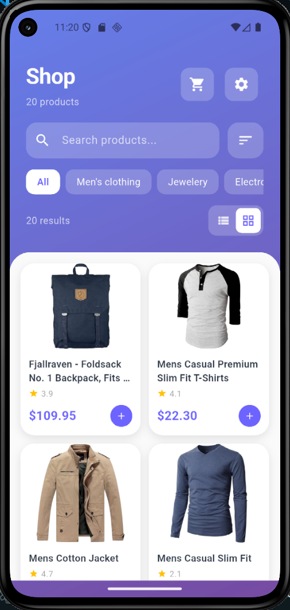
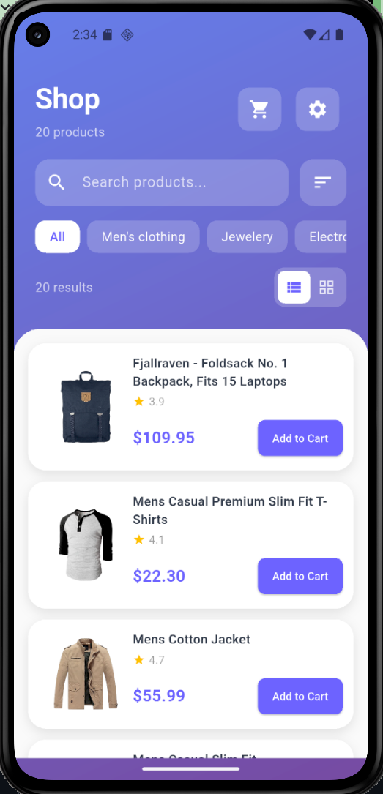
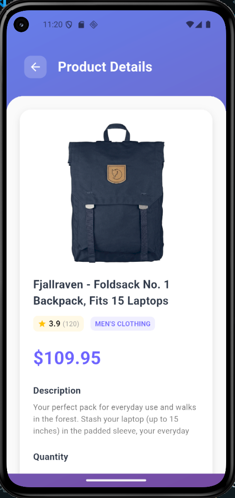
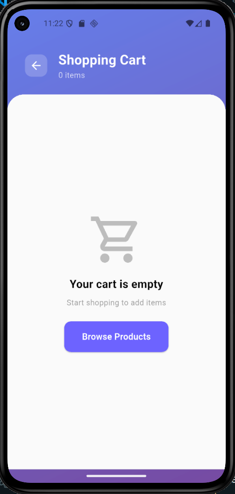
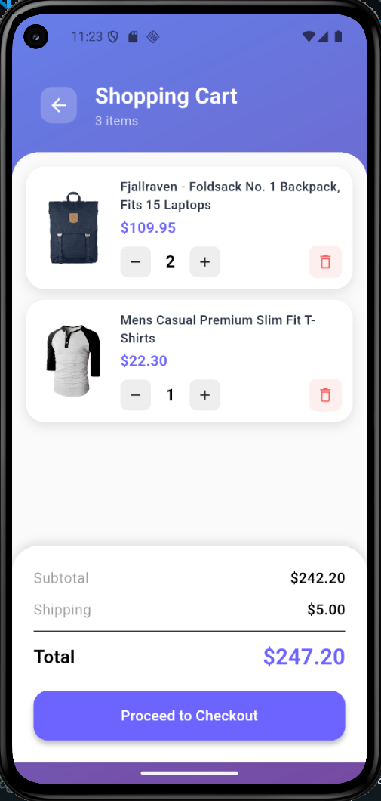
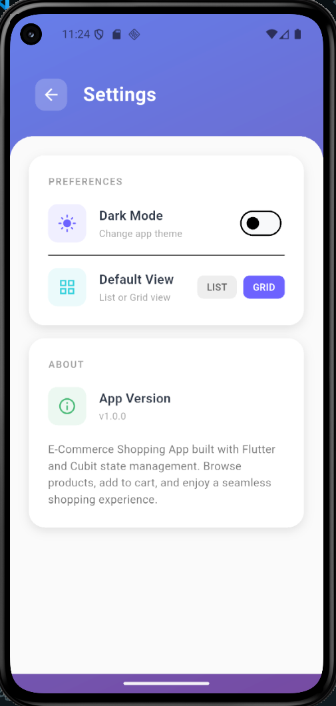
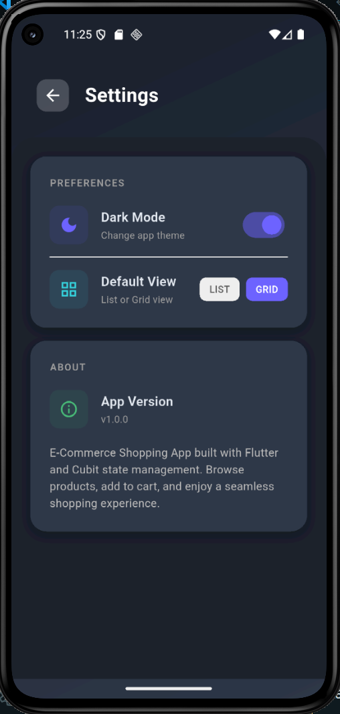
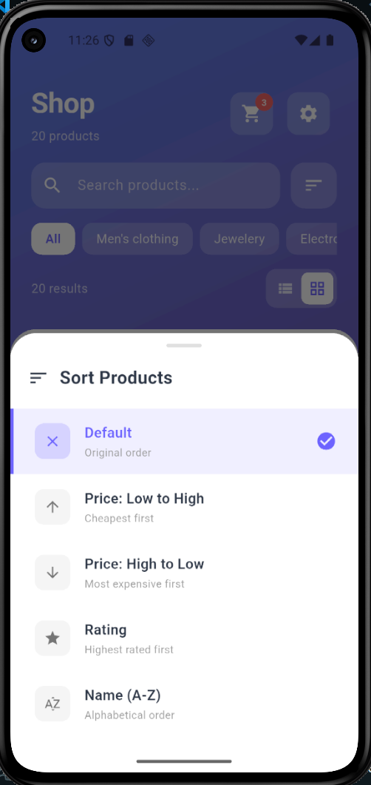

# 🛍️ E-Commerce Shopping App

A beautiful, full-featured Flutter e-commerce application with Cubit state management, real-time cart updates, and seamless shopping experience.


## Screenshots

|               Home Screen (Grid)               |              Home Screen (List)               |                 Product Detail                 |
| :--------------------------------------------: | :-------------------------------------------: | :--------------------------------------------: |
|  |  |  |

|                 Shopping Cart                  |                                                |
| :--------------------------------------------: | :--------------------------------------------: |
|  |  |

|                    Settings                    |                    DarkMod                     |
| :--------------------------------------------: | :--------------------------------------------: |
|  |  |

|                  Sort Options                  |
| :--------------------------------------------: |
|  |

## Features

### Core Features

- **Product Browsing** - View products in grid or list layout
- **Search Functionality** - Real-time product search by title/description
- **Category Filtering** - Filter products by category (Clothing, Jewelry, Electronics)
- **Product Sorting** - Sort by price, rating, or name
- **Product Details** - View complete product information with images
- **Shopping Cart** - Add, remove, and update item quantities
- **Cart Persistence** - Cart saved locally and restored on app restart
- **Real-time Updates** - Instant UI updates for all cart operations

### UI/UX Features

- **Beautiful Gradient Design** - Modern purple gradient theme
- **Dark Mode Support** - Toggle between light and dark themes
- **View Mode Toggle** - Switch between grid and list views
- **Image Caching** - Fast image loading with caching
- **Loading States** - Smooth loading indicators
- **Error Handling** - Graceful error messages with retry options
- **Empty States** - Helpful messages for empty cart/search
- **Pull to Refresh** - Refresh products by pulling down
- **Responsive Design** - Works on all screen sizes

### Technical Features

- **Cubit State Management** - Clean, maintainable state management
- **API Integration** - FakeStore API for product data
- **Local Persistence** - SharedPreferences for data storage
- **Offline Caching** - Cached products available offline
- **Immutable States** - Proper state management with copyWith
- **Clean Architecture** - Separated concerns (Models, Services, Cubits, Screens)

## 🏗️ Architecture

```
lib/
├── main.dart                           # App entry point
├── models/
│   ├── product.dart                    # Product data model
│   └── cart_item.dart                  # Cart item model
├── services/
│   ├── api_service.dart                # API calls (FakeStore)
│   └── cache_service.dart              # Local storage (SharedPreferences)
├── cubits/
│   ├── product/
│   │   ├── product_cubit.dart          # Product state management
│   │   └── product_state.dart          # Product states
│   ├── cart/
│   │   ├── cart_cubit.dart             # Cart state management
│   │   └── cart_state.dart             # Cart states
│   └── theme/
│       ├── theme_cubit.dart            # Theme state management
│       └── theme_state.dart            # Theme states
├── screens/
│   ├── home_screen.dart                # Product listing
│   ├── product_detail_screen.dart      # Product details
│   ├── cart_screen.dart                # Shopping cart
│   └── settings_screen.dart            # App settings
└── utils/
    └── app_styles.dart                 # Colors, themes, styles
```

## Getting Started

### Prerequisites

- Flutter SDK: `>=3.0.0`
- Dart SDK: `>=3.0.0`
- Android Studio / VS Code with Flutter extensions
- An emulator or physical device

### Installation

1. **Clone the repository**

```bash
git clone https://github.com/yourusername/ecommerce_app.git
cd ecommerce_app
```

2. **Install dependencies**

```bash
flutter pub get
```

3. **Run the app**

```bash
flutter run
```

## 📦 Dependencies

```yaml
dependencies:
  flutter:
    sdk: flutter

  # State Management
  flutter_bloc: ^8.1.3
  equatable: ^2.0.5

  # Networking
  http: ^1.1.0

  # Local Storage
  shared_preferences: ^2.2.2

  # UI
  cached_network_image: ^3.3.0
```

## 🔌 API Integration

This app uses the **FakeStore API** for product data:

- **Base URL**: `https://fakestoreapi.com`
- **Endpoints Used**:
  - `GET /products` - Fetch all products
  - `GET /products/{id}` - Fetch single product

### API Response Example

```json
{
  "id": 1,
  "title": "Fjallraven - Foldsack No. 1 Backpack",
  "price": 109.95,
  "description": "Your perfect pack for everyday use...",
  "category": "men's clothing",
  "image": "https://fakestoreapi.com/img/81fPKd-2AYL._AC_SL1500_.jpg",
  "rating": {
    "rate": 3.9,
    "count": 120
  }
}
```

## State Management Pattern

This app uses **Cubit** (simplified Bloc) for state management:

### ProductCubit

```dart
// Load products from API
context.read<ProductCubit>().loadProducts();

// Search products
context.read<ProductCubit>().searchProducts('shirt');

// Filter by category
context.read<ProductCubit>().filterByCategory('electronics');

// Sort products
context.read<ProductCubit>().sortProducts('price_low');
```

### CartCubit

```dart
// Add item to cart
context.read<CartCubit>().addItem(product, quantity: 2);

// Update quantity
context.read<CartCubit>().updateQuantity(productId, 3);

// Remove item
context.read<CartCubit>().removeItem(productId);

// Clear cart
context.read<CartCubit>().clearCart();
```

### ThemeCubit

```dart
// Toggle dark mode
context.read<ThemeCubit>().toggleDarkMode();

// Set view mode
context.read<ThemeCubit>().setViewMode('grid'); // or 'list'
```

## Features Walkthrough

### 1. Product Browsing

- View products in **grid** (2 columns) or **list** (1 column) layout
- Each product shows image, title, price, and rating
- Tap product to view details
- Pull down to refresh product list

### 2. Search & Filter

- **Search**: Type in search bar to filter by product name or description
- **Categories**: Tap category chips to filter (All, Clothing, Jewelry, Electronics)
- **Sort**: Tap sort icon to open sort options
  - Default (original order)
  - Price: Low to High
  - Price: High to Low
  - Rating (highest first)
  - Name (A-Z)

### 3. Shopping Cart

- Add items from product detail screen
- Adjust quantity with +/- buttons (updates in real-time)
- Remove items with delete icon
- View subtotal, shipping ($5), and total
- Cart persists even after closing the app

### 4. Settings

- Toggle dark mode (saved preference)
- Switch between grid/list view (saved preference)
- View app version and about information

## Data Persistence

### What Gets Saved?

1. **Shopping Cart** - All cart items with quantities
2. **Products Cache** - Last fetched product list (for offline use)
3. **Dark Mode** - User's theme preference
4. **View Mode** - Grid or list preference

### Storage Implementation

```dart
// Using SharedPreferences
final prefs = await SharedPreferences.getInstance();

// Save cart
await prefs.setString('shopping_cart', jsonEncode(cartItems));

// Load cart
final cartJson = prefs.getString('shopping_cart');
final cartItems = jsonDecode(cartJson);
```

## Theming

### Color Palette

```dart
Primary Color:    #6C63FF (Purple)
Secondary Color:  #36D1DC (Cyan)
Accent Color:     #FF6B6B (Red)
Success Color:    #48BB78 (Green)
Error Color:      #F56565 (Red)
```

### Dark Mode

- Automatically switches background colors
- Adjusts text colors for readability
- Maintains gradient header in both modes

## Testing

### Manual Testing Checklist

**Product Features:**

- [ ] Products load on startup
- [ ] Images display correctly
- [ ] Grid view works
- [ ] List view works
- [ ] Search filters products
- [ ] Category filter works
- [ ] Sort options work
- [ ] Pull-to-refresh works

**Cart Features:**

- [ ] Add to cart from home screen
- [ ] Add to cart from detail screen
- [ ] Quantity increases in real-time
- [ ] Quantity decreases in real-time
- [ ] Remove item works
- [ ] Cart persists after restart
- [ ] Cart badge shows correct count
- [ ] Totals calculate correctly

**Settings:**

- [ ] Dark mode toggles
- [ ] View mode toggles
- [ ] Preferences persist

**Offline Mode:**

- [ ] Cached products load when offline
- [ ] Error message shows for failed API calls

## Author

**Your Name**

- GitHub: [@HasanorDim](https://github.com/HasanorDim)
